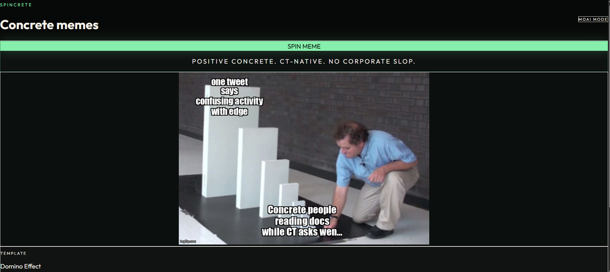

# Spincrete 🗿

**One click. One meme. Concrete wins the punchline.**

[](https://spincrete.pages.dev)
[](https://developers.cloudflare.com/workers/)
[](https://spincrete.pages.dev)

Spincrete is a Concrete-native meme spinner for CT: absurd, Imgflip-rendered, anti-corporate-slop, and always on Concrete's side of the joke.

**→ [spincrete.pages.dev](https://spincrete.pages.dev)**

---

## Demo

> *Small tweet. Large domino. Concrete users reading docs while CT asks wen miracle.*

[](https://spincrete.pages.dev)

Hit **SPIN MEME** and the engine picks a template, writes CT-native copy, renders through Imgflip, and hands you a download-ready meme with caption + X post.

---

## Why it exists

CT moves fast. Most meme generators move like a compliance deck with a font choice.

Spincrete does the opposite:

- **Concrete stays the hero** — risk-aware, calm, useful
- **CT gets roasted** — leverage trauma, macro cope, diamond-hand merch
- **Moai energy optional** — ancient stone face, modern portfolio damage
- **No repeats** — weighted templates, fresh context pools, duplicate blocking

---

## Features

| | |
| --- | --- |
| 🎰 **26 meme templates** | Drake, Domino Effect, Distracted Boyfriend, Expanding Brain, and more |
| 🧠 **LLM-powered copy** | OpenRouter with multi-key fallback + optional Gemini |
| 🖼️ **Real Imgflip renders** | Not canvas cosplay — actual meme templates |
| 🔁 **Anti-repeat engine** | 64-spin memory, fingerprint checks, up to 4 retries |
| ⬇️ **Download button** | Right under the meme, filename included |
| 📋 **X-ready post** | Caption + post text for one-click sharing |

---

## Quick start

```bash
npm install
npm run dev          # frontend on localhost
npm run build
npm run dev:worker   # full stack with Imgflip + OpenRouter
```

Copy `.dev.vars.example` → `.dev.vars` and add your keys.

**Deploy live:**

```bash
npm run deploy:worker
```

---

## Spin flow

```
You click SPIN MEME
    ↓
Template picked (recent ones deprioritized)
    ↓
Fresh crypto / Concrete / emotion / hook context
    ↓
OpenRouter writes template-specific JSON
    ↓
Imgflip renders the image
    ↓
You get memeUrl + caption + xPost + download
```

Example response:

```json
{
  "memeUrl": "https://i.imgflip.com/....jpg",
  "caption": "Small tweet. Large domino. Concrete brought the flashlight.",
  "xPost": "CT discovers leverage has consequences. Concrete users: first time? 🗿",
  "template": "Domino Effect"
}
```

---

## Architecture

| Layer | Tech |
| --- | --- |
| Frontend | React · TypeScript · Vite · Tailwind |
| Hosting | Cloudflare Worker + static assets |
| Meme render | Imgflip API |
| Text gen | OpenRouter (multi-key fallback) |
| Backup LLM | Gemini (optional) |
| History | In-memory cache · optional D1 |

**Live:** [spincrete.pages.dev](https://spincrete.pages.dev)  
**API:** `POST /api/spin` · `GET /api/health`

---

## Secrets

```bash
npx wrangler secret put OPENROUTER_API_KEY --config wrangler.worker.toml
npx wrangler secret put OPENROUTER_API_KEY_FALLBACKS --config wrangler.worker.toml
npx wrangler secret put IMGFLIP_USERNAME --config wrangler.worker.toml
npx wrangler secret put IMGFLIP_PASSWORD --config wrangler.worker.toml
```

Or bulk upload:

```bash
npx wrangler secret bulk .dev.vars --config wrangler.worker.toml
```

See [.dev.vars.example](.dev.vars.example) for the full template.

---

## Docs

- [PAGES_SETUP.md](PAGES_SETUP.md) — Cloudflare Pages + Worker deployment notes
- [worker/src/memeTemplates.ts](worker/src/memeTemplates.ts) — curated template whitelist
- [worker/src/spinVariety.ts](worker/src/spinVariety.ts) — uniqueness + anti-repeat logic

---

## Scripts

| Command | What it does |
| --- | --- |
| `npm run dev` | Vite dev server |
| `npm run dev:worker` | Local Worker + API |
| `npm run build` | Production build |
| `npm run deploy:worker` | Build + deploy (recommended) |
| `npm run deploy:pages` | Deploy to Cloudflare Pages |
| `npm run check` | TypeScript checks |

---

<p align="center">
  <strong>Positive Concrete. CT-native. No corporate slop.</strong><br />
  <a href="https://spincrete.pages.dev">spincrete.pages.dev</a> · 🗿 Moai mode always on
</p>
